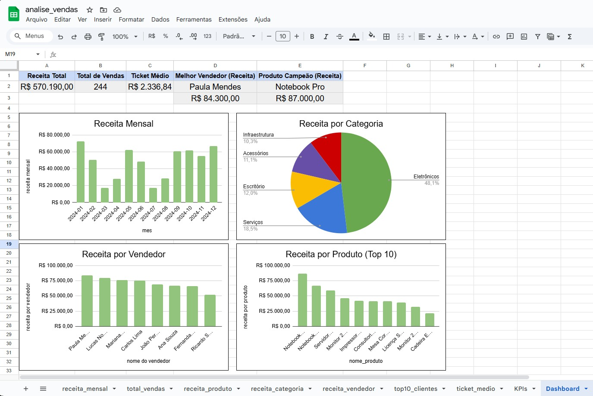

# 📊 Projeto – Análise de Vendas com SQL (MySQL)

## 📌 Visão Geral
Este projeto tem como objetivo realizar uma análise completa de vendas utilizando MySQL para modelagem, carga e consultas dos dados, e Google Sheets para visualização, KPIs e construção de um dashboard analítico.

O fluxo do projeto simula um cenário real de trabalho em dados:
Banco de dados → consultas SQL → exportação → dashboard executivo.

---

## 🗂️ Estrutura do Projeto

```
├── schema.sql        # Criação do banco de dados e tabelas (DDL)
├── inserts.sql       # Inserção de dados fictícios (DML)
├── queries.sql       # Consultas analíticas e de negócio (DQL)
├── Dashboard.jpeg    # Visualização das consultas
└── README.md         # Documentação do projeto
```

---

## 🎯 Objetivos do Projeto

- Praticar modelagem de banco de dados relacional
- Desenvolver consultas SQL analíticas
- Gerar insights de negócio a partir dos dados
- Criar KPIs e dashboards
- Integrar banco de dados com Google Sheets
- Organizar um projeto completo para portfólio

---

## 🧱 Modelagem do Banco de Dados

O banco de dados foi modelado seguindo boas práticas de normalização e integridade referencial, com as seguintes entidades principais:

- clientes – dados cadastrais dos clientes
- produtos – catálogo de produtos disponíveis para venda
- vendedores – responsáveis pelas vendas
- vendas – registros das transações realizadas
- itens_venda – detalhamento dos produtos vendidos em cada venda
  
Relacionamentos principais:

- Um cliente pode ter várias vendas
- Uma venda pode conter vários itens
- Cada item de venda está associado a um produto
- Cada venda é atribuída a um vendedor

---

## 📥 Carga de Dados

O projeto utiliza dados fictícios distribuídos de forma realista, incluindo:

- ~80 clientes
- 20 produtos
- 244 vendas
- 400+ registros em itens_venda

---

## ℹ️ Observação sobre os Dados

Nem todas as vendas possuem itens associados. Isso foi feito propositalmente para simular cenários reais, como:

- vendas canceladas
- vendas incompletas
- registros criados antes da finalização

---

## 📈 Consultas Analíticas (queries.sql)
O arquivo queries.sql contém consultas que respondem a perguntas reais de negócio, incluindo:

- Receita total por produto
- Quantidade vendida por produto
- Receita mensal
- Receita acumulada ao longo do tempo (Window Function)
- Clientes com maior volume de compras
- Vendedores com maior faturamento
- Identificação de vendas sem itens associados

Destaque técnico:
- Uso de JOINs complexos
- Agregações com SUM, COUNT
- Window Functions (SUM() OVER)
- Subqueries e aliases
- Ordenação e agrupamento para análise temporal

---

## 🔍 Exemplo de Consulta Avançada
``` sql
SELECT
  mes,
  receita_mensal,
  SUM(receita_mensal) OVER (ORDER BY mes) AS receita_acumulada
FROM (
  SELECT
    DATE_FORMAT(v.data_venda, '%Y-%m') AS mes,
    SUM(iv.quantidade * iv.preco_unitario) AS receita_mensal
  FROM vendas v
  JOIN itens_venda iv ON v.id_venda = iv.id_venda
  GROUP BY mes
) t;
```
Essa consulta calcula a receita mensal e a receita acumulada ao longo do tempo, demonstrando domínio de SQL analítico moderno.

---

## 📊 Integração com Google Sheets
Os resultados das consultas SQL foram exportados e organizados em abas específicas no Google Sheets, como:

- receita_mensal
- total_vendas
- receita_produto
- receita_categoria
- receita_vendedor
- top10_clientes
- ticket_medio

Essas abas servem como base de dados para KPIs e gráficos.

---

## 📌 KPIs Criados
Na aba KPIs, foram calculados indicadores estratégicos, como:

- 💰 Receita Total
- 🧾 Total de Vendas
- 📦 Ticket Médio
- 🏆 Melhor Vendedor (por Receita)
- ⭐ Produto Campeão (por Receita)

Os KPIs são alimentados dinamicamente a partir das abas de dados.

---

## 📷 Dashboard


---

## 💡 Insights Obtidos

A partir das análises realizadas e do dashboard construído, foi possível identificar alguns insights relevantes:

- A receita apresenta variação ao longo dos meses, indicando sazonalidade nas vendas.
- Um pequeno grupo de produtos concentra a maior parte do faturamento, evidenciando a importância do mix de produtos.
- Alguns vendedores se destacam significativamente em relação à receita gerada, o que pode indicar boas práticas comerciais.
- O ticket médio permanece relativamente estável, sugerindo consistência no comportamento de compra dos clientes.

Esses insights demonstram como o uso de SQL aliado à visualização de dados pode apoiar a tomada de decisão no contexto de negócios.

---

## ▶️ Como Executar o Projeto

1. Abra o MySQL Workbench  
2. Execute os arquivos na seguinte ordem:
   - `schema.sql`
   - `inserts.sql`
   - `queries.sql`
3. Exporte os resultados das queries para CSV
4. Importe cada CSV como uma aba no Google Sheets
5. Utilize as abas para criar KPIs, gráficos e o dashboard final

---

## 🛠️ Tecnologias Utilizadas

MySQL
- Criação de schema relacional
- Inserção de dados fictícios
- Consultas analíticas com JOIN, GROUP BY, ORDER BY
- Funções de data e agregação

Google Sheets
- Importação dos resultados das consultas SQL
- Tratamento de dados (texto → número / moeda)
- KPIs com fórmulas
- Criação de gráficos e dashboard

GitHub
- Versionamento do schema, inserts e queries
- Documentação do projeto

---

## 🧑‍💻 Autor

**Eduardo Ribeiro**
- 📍 Brasil
- 🎯 Estudante de Análise de Dados | SQL | Google Sheets | Excel

---

🗓️ Última atualização

Última atualização: Dezembro de 2025
